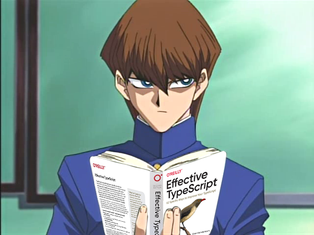

# Bishies-Holding-Programming-Books

    

Bishies Holding Programming Books, based on the legendary [Anime Girls Holding Programming Books](https://github.com/cat-milk/Anime-Girls-Holding-Programming-Books).

# Contribution Guidelines

* __NSFW images aren't allowed due to [Github Site Policy](https://docs.github.com/en/site-policy);__

* Pictures can't be related to cryptocurrency or its technologies;
* Images must have descriptive file names in the following format (The file doesn't have to be "png" format, this is just an example):
    Name_Name_Book_Book.png

* Add your images to the folder that best describes the subject matter of the book that the girl is holding. If no existing folder applies, create a new one. The simpler the name, the better;

* All characters must be "[Bishounens](https://tvtropes.org/pmwiki/pmwiki.php/Main/Bishonen)", in the English fandom connotation: "a really, really attractive male".
  But remember: attractiveness is in the eye of the beholder. Sometimes, so is maleness.
